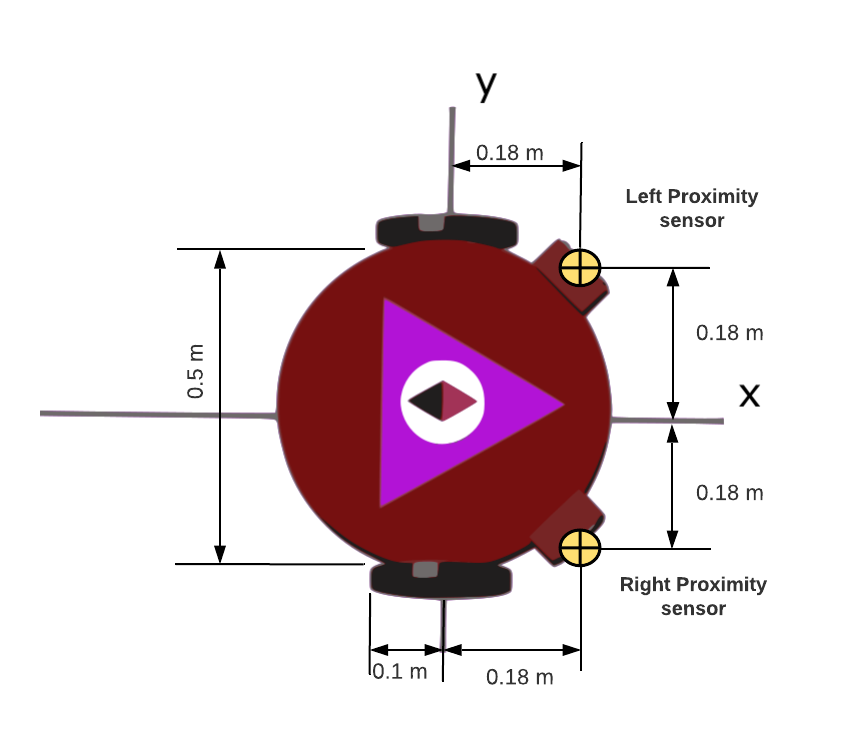
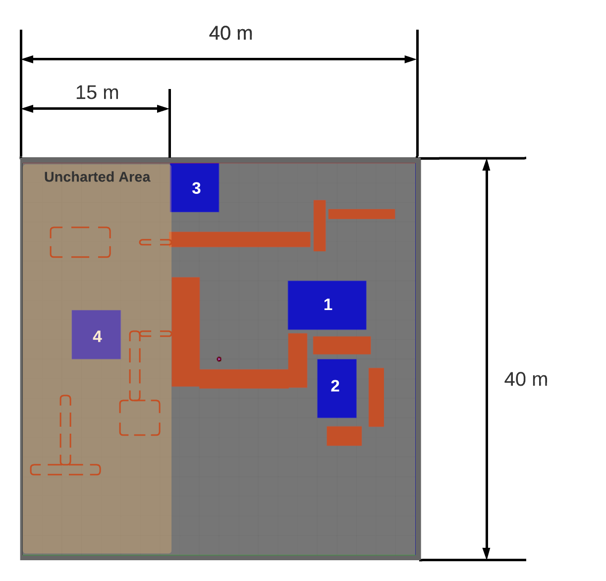

# Competición Unrobot simulación 
Este repositorio contiene el código base necesario para participar en los retos de simulación del UN robot tanto intermedio como avanzado. estos retos consisten en desarrollar algoritmos de posicionamiento y localización utilizando el entorno de simulación de Robotics Playground.

## especificaciones 
 

