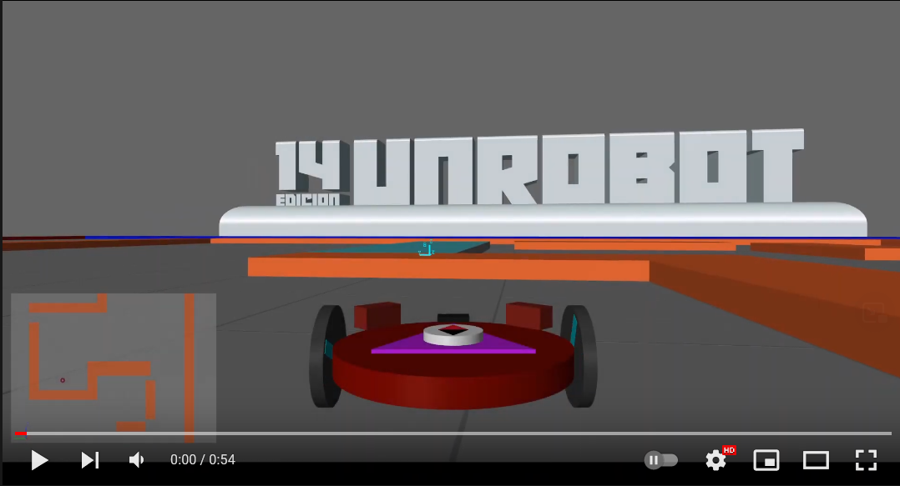
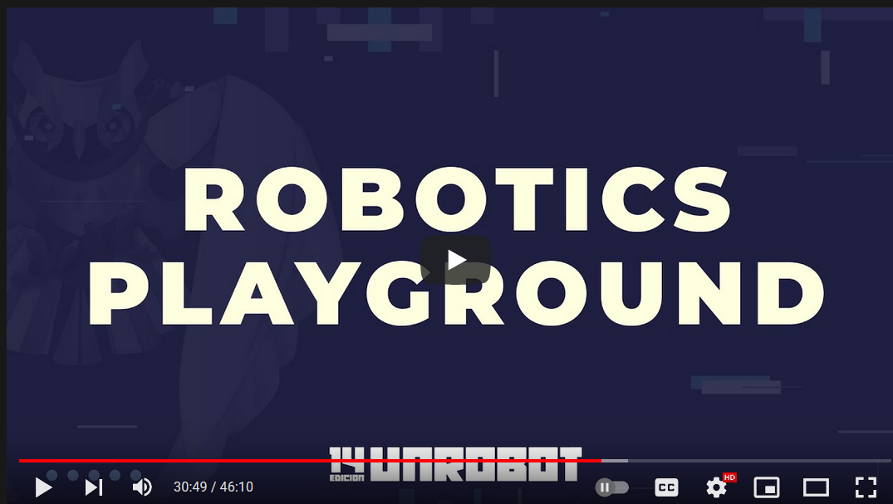
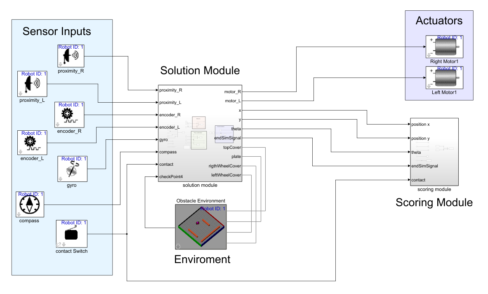

# Competición UNRobot simulación 👉 [Inscríbete](https://docs.google.com/forms/d/e/1FAIpQLSc2hobkpVgkxnECSdLmDt7OksRm5p6DZgrpnfqgwDmuXKKJpw/viewform)

# Contenido 

  - [Charlas técnicas](#charlas-técnicas)
  - [Getting Started](#getting-started)
  - [Guía especificaciones](#guía-especificaciones)
  - [Robot](#robot)
  - [Arena](#arena)
  - [Ambiente de programación](#ambiente-de-programación)

Este repositorio contiene el código base necesario para participar en los retos de simulación del UN robot tanto intermedio como avanzado. estos retos consisten en desarrollar algoritmos de posicionamiento y localización utilizando el entorno de simulación de [Robotics Playground](https://www.mathworks.com/matlabcentral/fileexchange/67157-robotics-playground).

## Charlas técnicas 

## Getting Started
Una vez configurado el [Ambiente de programación](#ambiente-de-programación) la forma de iniciar la simulación es sencilla solo hay que correr el archivo [setup.m](setup.m) dentro de MATLAB. Para editar el modelo escoge el archivo [UNrobot_pro.slx](UNrobot_pro.slx) o  [UNrobot_intermediate.slx](UNrobot_intermediate.slx) Estos son los únicos archivos que requieres para desarrollar tu solución. 

Los demás archivos contienen versiones modificadas de archivos de _robotics playground_ por lo que debes mantenerlos dentro de  la carpeta donde desarrolles tu solución no es recomendable que añadas este directorio a el PATH de MATLAB ya que puede generar incompatibilidades  al momento de usar el robotics playground.   

## Guía especificaciones 

* [Reto Simulación Profesional](media/Reto_Simulacion_Profesional_Guia_de_Especificaciones.pdf)
* [Reto Simulación Intermedio](media/Reto_Simulacion_Profesional_Guia_de_Especificaciones.pdf)
  

## Robot
Es un robot diferencial equipado con encoder en las ruedas sensores de proximidad, giroscopio, magnetómetro.

## Arena
El ambiente se divide en 2 secciones: el lado derecho donde los obstáculos permanecerán  inalterados y el lado  izquierdo demarcado como Uncharted Area  donde  se incorporarán  obstáculos de tamaños arbitrarios y en posiciones no especificadas. 

## Ambiente de programación 
Para la de este proyecto se requiere una instalación de:
* Matlab (versión recomendada 2021a) 
* Entorno de programación simulink  incluyendo las
* bibliotecas de simscape Mechanics y simscape Electronics 
* Toolbox robotics playground

